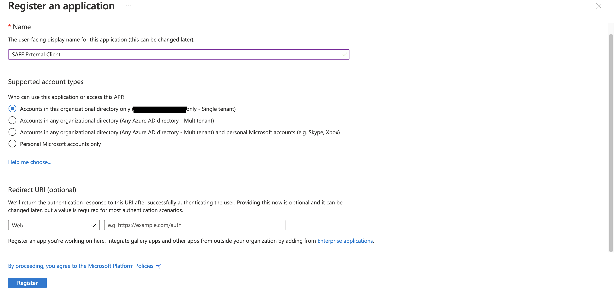
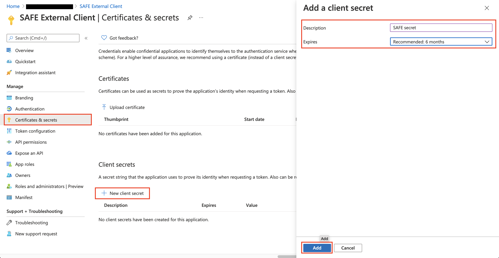
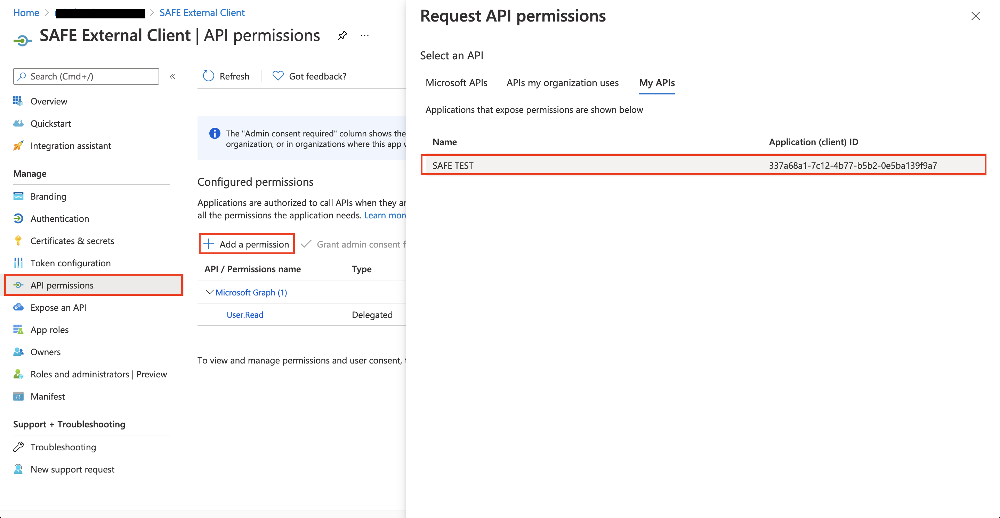
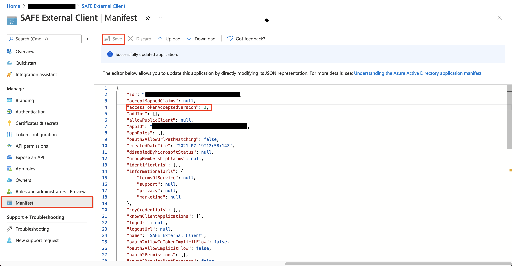

Client Credentials Flow authentication for SAFE back-end
======= 

This readme details the process to authenticate to SAFE back-end using the client credentials flow. This flow is used for giving access to SAFE API to a user as an application and not as an individual. In this way permissions will be linked to the client application and every user of this application will share the same access to resources.

*   [Azure configuration](#azure-configuration)
*   [Code setup (Node)](#code-setup-node)
    *   [Prerequisities](#prerequisities)
    *   [Samples](#samples)
# Azure configuration

- Create a new app registration for your client.



- Create a client secret.



- Ask for the permission to access the azure application used by the SAFE API you want to connect to.



- Select the app role used for external applications by the SAFE.


- Make sure that the `accessTokenAcceptedVersion` property in your client application's manifest is set to `2`.



# Code setup (Node)

You can find in this repo a little script which allows you to authenticate to SAFE API using a client credentials flow. This quickstart script has been made using the following AzureAD sample: https://github.com/AzureAD/microsoft-authentication-library-for-js/tree/dev/samples/msal-node-samples/client-credentials


## Prerequisities
The script has three depedencies: 

- `@azure/msal-node`
- `dotenv`
- `node-fetch` (can be replaced by any HTTP request library)

You must also fill the `.env` file with the following variables:
| Name    | Note      | 
| ----------- | ----------- |
| TENANT_ID | The tenant ID of your AAD where you have created the client application registration | 
| CLIENT_ID | The application ID of your application used for client credential flow |
| CLIENT_SECRET | The secret generated in the previous steps |
| AAD_ENDPOINT | `https://login.microsoftonline.com/` |
| SCOPE | The SAFE application ID URI `api://{SAFE_ID}` |
| SAFE_API | The SAFE API URL, on local instance: `http://localhost:3000/graphql` |
## Samples

In the first part of the script, we initialize the msal config, the system property can be removed for production and is only useful for logging.
``` javascript
const msal = require('@azure/msal-node');
const fetch = require('node-fetch');
const dotenv = require('dotenv');
dotenv.config();

const msalConfig = {
	auth: {
		clientId: process.env.CLIENT_ID,
		authority: process.env.AAD_ENDPOINT + process.env.TENANT_ID,
		clientSecret: process.env.CLIENT_SECRET,
	},
    system: {
        loggerOptions: {
            loggerCallback(loglevel, message, containsPii) {
                console.log(message);
            },
            piiLoggingEnabled: false,
            logLevel: msal.LogLevel.Verbose,
        }
    }
};

const cca = new msal.ConfidentialClientApplication(msalConfig);
```

Then we fetch the token for the SAFE application scope.
``` javascript
const tokenRequest = {
    scopes: [process.env.SCOPE],
};
const authResponse = await cca.acquireTokenByClientCredential(tokenRequest);
```

Finally we can use the token in the headers of our request as follows.

``` javascript
fetch(process.env.SAFE_API, {
    method: 'post',
    headers,
    body: JSON.stringify({ "query": "query GetApplications {\napplications {    id \n  name  }  }" })
}).catch(err => console.log('FETCH ERROR', err))
.then(res => res.json())
.then(json => console.log('APPLICATIONS', json.data.applications));
```
